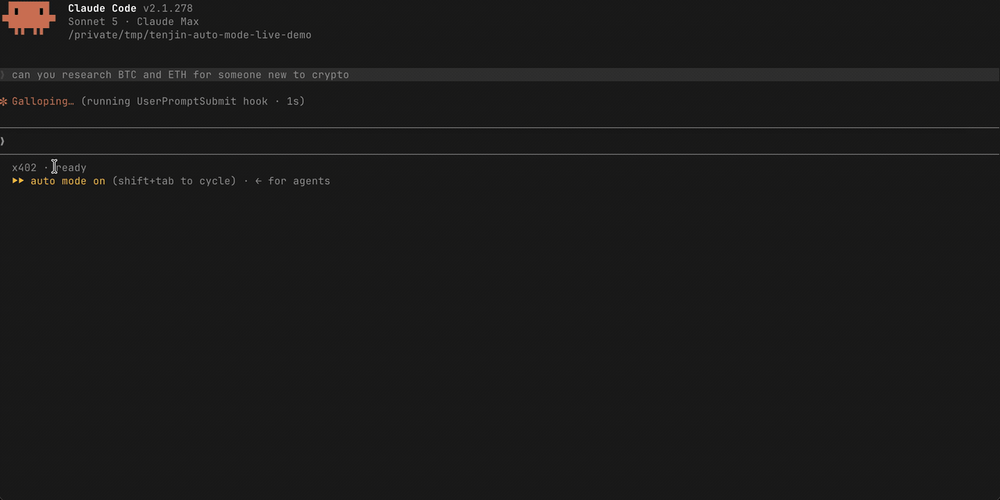
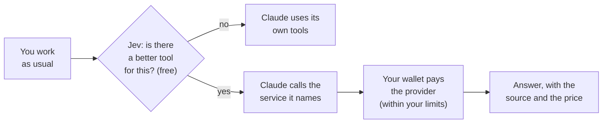

<p align="center">
  <picture>
    <source media="(prefers-color-scheme: dark)" srcset="./assets/logo-dark.svg">
    
  </picture>
</p>

<h3 align="center">The tool router for coding agents.</h3>

<p align="center">
  Give your agent superpowers once. Tenjin hands it the right tool when it helps, and you keep working like before.<br>
  No API keys. No pile of MCP servers. No rules to write.
</p>

<p align="center">
  <a href="https://www.npmjs.com/package/tenjin-cli"></a>
  
  
  
  
</p>

<p align="center">
  <a href="#quick-start">Quick start</a> ·
  <a href="#what-it-can-do">Tools</a> ·
  <a href="#the-wallet-in-plain-english">The wallet, explained</a> ·
  <a href="#request-a-tool">Request a tool</a>
</p>

<!--
  DEMO: drop the GIF or video here, centered at ~720px wide:
  <p align="center"></p>
-->

---

## Why

Giving your agent good tools is a chore today:

- **A key for every tool.** Sign up, pick a plan, paste an API key into a config file. Five tools, five accounts.
- **MCP servers crowd the context.** Every server you install loads its tool definitions into every session, needed or not.
- **Your agent forgets anyway.** It reaches for plain web search out of habit, so you write rules to remind it, and it still slips.
- **Some tools you need once.** Installing something permanent for a one-off lookup isn't worth the setup.

Tenjin takes all of that off your plate. Install it once and work as you normally do. Jev, Tenjin's router, watches the moments where a tool could help: your prompt, your agent's web searches and page fetches, and the tasks it hands to subagents. When a curated, maintained tool would do better than what your agent was about to do, Jev suggests it, and your agent uses it. Every tool is paid per call through [x402](#the-wallet-in-plain-english), so there are no keys to manage and nothing new to download.

Works with **Claude Code** today. **Codex** is coming soon.

## Quick start

You need **Node.js 24+** and **[Claude Code](https://code.claude.com)**.

```bash
npm i -g tenjin-cli
tenjin install          # sets up Claude Code and creates your wallet
tenjin wallet fund 2    # optional: add $2 with a card, via Coinbase
```

```text
✓ Tenjin is set up for Claude Code
✓ Wallet created: 0x3c0D84055994c3062819Ce8730869D0aDeA4c3Bf
  Automatic router: up to $0.25 per call; daily limit $5 a day

Next: tenjin wallet fund, then restart Claude Code
```

Restart Claude Code. That's it.

Now just work as usual. When a lookup fits a service, Tenjin steps in:

```text
> What are BTC and ETH trading at?
> How do I paginate list results with the Stripe Node SDK?
> Is ada@example.com a deliverable address?
> Integrate x^2 sin(x) dx from 0 to pi.
```

Every answer says **who supplied it and what it cost**. Your agent's own tools keep working; Tenjin only offers a better option when there is one.

## What it can do

Jev picks from a curated, maintained catalog. Choosing a service is always free. You pay the provider only when a paid one runs.

|     | Tool                                                             | What your agent gets                                        | Price per call |
| --- | ---------------------------------------------------------------- | ----------------------------------------------------------- | -------------- |
| 📚  | **Docs lookup** · [Context7](https://context7.com)               | Current, version-specific docs for a library or API         | **Free**       |
| 🔎  | **Web research** · [Exa](https://exa.ai)                         | Search results with the page content, not just links        | $0.007         |
| 📄  | **Read a page** · [Firecrawl](https://firecrawl.dev)             | One exact page as clean text, even when a plain fetch fails | $0.01          |
| 📈  | **Crypto prices** · [CoinMarketCap](https://coinmarketcap.com)   | Live quotes for any coin                                    | $0.01          |
| 🧮  | **Compute** · [Wolfram Alpha](https://www.wolframalpha.com)      | Math, unit conversions, science and data questions          | $0.02          |
| ✉️  | **Email check** · [Hunter](https://hunter.io)                    | Whether an address is real and deliverable                  | $0.03          |
| 👤  | **Person lookup** · Minerva                                      | A professional profile from a name or email                 | $0.05          |
| 🏢  | **Company profile** · [CompanyEnrich](https://companyenrich.com) | Size, industry, funding and socials from a domain or name   | $0.06          |

Free tools run without a funded wallet. Twitter, Reddit and more are next, added by demand: [tell us what you want](#request-a-tool).

## How it works



1. **Route.** At your prompt, before your agent's web searches and fetches, and when it delegates to a subagent, Jev checks whether a tool fits. Deciding is free and there's no router fee.
2. **Offer.** If one fits, Claude sees a single line naming it and the price. It's an option, not an order.
3. **Pay.** If Claude takes it, the Tenjin CLI pays the provider directly from your wallet, only within the limits you set.
4. **Answer.** The result comes back with the provider and the cost attached.

While a lookup runs, your status line shows it live:

```text
x402 · request: calling pro-api.coinmarketcap.com/x402/v3/cryptocurrency/quotes/latest · {"query":{"symbol":"BTC,ETH"}}
```

## The wallet, in plain English

Paying per call is what lets you skip API keys and subscriptions. Here's what's going on, without the crypto jargon.

**What is it?** A small wallet, created on your machine by `tenjin install`, that holds a few dollars for your agent to spend. Think of it as a prepaid card with a daily limit.

**What's in it?** [USDC](https://www.circle.com/usdc), a digital dollar: 1 USDC is always worth $1. It lives on [Base](https://base.org), a network built by Coinbase where a payment costs a fraction of a cent to settle. Paying for lookups needs no other coin and no gas.

**How does the agent pay?** Through [x402](https://www.x402.org), an open payments standard. The service replies "that'll be 1¢", your wallet signs for exactly that amount, and the answer comes back, all in one request. No account is created anywhere, and no card number is ever shared.

**Who holds the money?** You do. The private key is generated on your machine, encrypted, and unlocked through your OS keychain. It never leaves your computer. Tenjin never holds your funds and cannot move them.

**What can it spend?** Only what you allow. Out of the box:

| Limit      | Default | Change it                             |
| ---------- | ------- | ------------------------------------- |
| Per lookup | $0.25   | `tenjin config set maxAutoSpend 0.10` |
| Per day    | $5      | `tenjin config set sessionBudget 2`   |

A payment that would go over either limit is refused before anything is signed.

**How much should I put in?** $1–2 is plenty to start. At today's prices, **$2 covers about**:

- ~280 web searches, or
- ~200 page reads or price checks, or
- ~100 Wolfram Alpha answers, or
- ~65 email checks

**How do I add funds?** `tenjin wallet fund 2` opens a Coinbase checkout for your wallet's address, where you pay with a card, or Apple Pay depending on your region (a Coinbase account is required). Already hold USDC? Send it on Base to the address from `tenjin wallet show`.

**Can I get it back out?** Yes. It's your money. `tenjin wallet send <amount> USDC <address>` moves it to any address you choose. Withdrawing is a normal onchain transfer, so it needs a few cents of ETH on Base for the network fee.

**What does Tenjin see?** To choose a service, the router sends the current turn and up to six recent messages, with keys, passwords and seed phrases masked out. Tool results and page contents never leave your machine. The packet expires after 15 minutes. Prefer less? `tenjin config set router.context turn` sends only the current message. [Exactly what's sent, and what install writes →](./docs/agent-permissions.md)

## Everyday commands

```bash
tenjin status                  # what you've spent today
tenjin wallet balance          # what's left
tenjin wallet fund 5           # top up
tenjin update                  # newest version; wallet and settings stay
tenjin config set router.enabled false             # pause the router on this machine
tenjin config set --project router.enabled false   # ...or just in this repo
tenjin uninstall               # remove the Claude Code setup; your wallet stays
```

Use `tenjin install --project` to set it up for a single project. Add `--json` to any command for machine-readable output.

<details>
<summary>Status line: keeping your own</summary>

`tenjin install` sets Claude Code's [status line](https://code.claude.com/docs/en/statusline) only if you don't already have one. If you do, yours is left alone and the install prints a command that shows both; `tenjin install --status-line compose` writes it for you, and `--status-line skip` leaves the setting untouched. The status line reads local files only: no network, no wallet, and it can't affect a lookup or a payment.

</details>

<details>
<summary>Spending limits: the fine print</summary>

Limits are set only where no setting exists yet, so an update never overwrites yours. The daily budget is a rolling 24-hour window. Setting either limit to `0` blocks automatic payments; `tenjin config set sessionBudget none` removes the daily ceiling only.

`tenjin pay <url>` pays any x402 endpoint you name. It ignores the automatic limits and always asks for your consent to the quoted price, interactively or with `--yes`. It is never used as a workaround when the router refuses. See the [safety model](./docs/safety-model.md).

</details>

<details>
<summary>Troubleshooting: Claude Code asks about a new project MCP server named <code>x402</code></summary>

Updating to `0.1.0-alpha.18` could accidentally register the server in `~/.mcp.json` while refreshing a user install. After upgrading to a release with the fix, check that file. If its `x402` entry runs `tenjin mcp` and you didn't install at project scope in your home directory on purpose, remove just that registration:

```bash
(cd ~ && claude mcp remove x402 -s project)
```

This keeps your other MCP entries and the user registration in `~/.claude.json`. Run `tenjin install`, then restart Claude Code. Don't use `tenjin uninstall --project` from home for this: its settings path is also the user settings path.

When refreshing from home, Tenjin keeps the existing user registration if there is one, or preserves a project-only registration; with neither, it defaults to user scope. `tenjin install --refresh --project` selects project scope explicitly.

</details>

## Request a tool

Tenjin is in alpha, and the catalog grows with what people ask for. Missing a service your agent keeps needing? Hit a lookup that went to the wrong place? We want to hear it.

- **[Request a tool →](https://github.com/BackTrackCo/tenjin-agent/issues/new?title=Tool%20request%3A%20&labels=enhancement)**
- **[Report a bug →](https://github.com/BackTrackCo/tenjin-agent/issues/new?labels=bug)**

## Learn more

- [How a lookup runs, what it sends, and what install writes](./docs/agent-permissions.md)
- [Safety model](./docs/safety-model.md)
- Exit codes: `0` success, `1` runtime or network failure, `2` usage error, `3` policy refusal, `4` payment failure.

## Developing

Before contributing, read [CONTRIBUTING.md](./CONTRIBUTING.md) for the contributor agreement.

```bash
pnpm install
pnpm run githooks   # once, to use the repo's git hooks
pnpm run build
pnpm run test
pnpm run typecheck
pnpm run lint
```

Release notes live in [RELEASING.md](./RELEASING.md).
