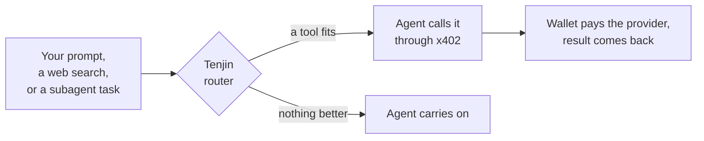

<p align="center">
  <picture>
    <source media="(prefers-color-scheme: dark)" srcset="./assets/logo-dark.svg">
    
  </picture>
</p>

<h3 align="center">The tool router for coding agents.</h3>

<p align="center">
  Give your agent superpowers once. Tenjin hands it the right tool when it helps, and you keep working like before.<br>
  No API keys. No pile of MCP servers. No rules to write.
</p>

<p align="center">
  <a href="https://www.npmjs.com/package/tenjin-cli"></a>
  
  
</p>

<p align="center">
  <a href="#quick-start">Quick start</a> ·
  <a href="#what-it-can-do">Tools</a> ·
  <a href="#wallet-and-payments">Wallet &amp; payments</a> ·
  <a href="#request-a-tool">Request a tool</a>
</p>

<!--
  DEMO: drop the GIF or video here, centered at ~720px wide:
  <p align="center"></p>
-->

---

## Why

Giving your agent good tools is a chore today:

- **A key for every tool.** Sign up, pick a plan, paste an API key into a config file. Five tools, five accounts.
- **MCP servers crowd the context.** Every server you install loads its tool definitions into every session, needed or not.
- **Your agent forgets anyway.** It reaches for plain web search out of habit, so you write rules to remind it, and it still slips.
- **Some tools you need once.** Installing something permanent for a one-off lookup isn't worth the setup.

Tenjin handles all of it. Install it once and keep working. The Tenjin router watches the moments where a tool could help: your prompt, your agent's web searches and page fetches, and the tasks it hands to subagents. When a curated tool beats what your agent was about to do, the router suggests it and your agent calls it. Your wallet pays for each call through [x402](#wallet-and-payments), so you manage no keys and install nothing new.

## Quick start

Requires Node.js 24 or newer and [Claude Code](https://code.claude.com). Codex support is on the way.

```bash
npm i -g tenjin-cli
tenjin install          # sets up Claude Code and creates your wallet
tenjin wallet fund 2    # optional: add $2 with a card, via Coinbase
```

```text
✓ Tenjin is set up for Claude Code
✓ Wallet created: 0x3c0D84055994c3062819Ce8730869D0aDeA4c3Bf
  Automatic router: up to $0.25 per call; daily limit $5 a day

Next: tenjin wallet fund, then restart Claude Code
```

Restart Claude Code. That's it.

Then work as usual. Try:

```text
> What are BTC and ETH trading at?
> How do I paginate list results with the Stripe Node SDK?
> Is ada@example.com a deliverable address?
> Integrate x^2 sin(x) dx from 0 to pi.
```

Each answer names the provider and the price. Your agent keeps its own tools, and the router steps in only when it has something better.

## What it can do

The router picks from a catalog we curate and maintain. Routing is free: you pay the provider's price and nothing else.

| Tool                                                             | What your agent gets                                        | Price per call |
| ---------------------------------------------------------------- | ----------------------------------------------------------- | -------------- |
| **Docs lookup** · [Context7](https://context7.com)               | Current, version-specific docs for a library or API         | **Free**       |
| **Web research** · [Exa](https://exa.ai)                         | Search results with the page content, not just links        | $0.007         |
| **Read a page** · [Firecrawl](https://firecrawl.dev)             | One exact page as clean text, even when a plain fetch fails | $0.01          |
| **Crypto prices** · [CoinMarketCap](https://coinmarketcap.com)   | Live quotes for any coin                                    | $0.01          |
| **Compute** · [Wolfram Alpha](https://www.wolframalpha.com)      | Math, unit conversions, science and data questions          | $0.02          |
| **Email check** · [Hunter](https://hunter.io)                    | Whether an address is real and deliverable                  | $0.03          |
| **Person lookup** · Minerva                                      | A professional profile from a name or email                 | $0.05          |
| **Company profile** · [CompanyEnrich](https://companyenrich.com) | Size, industry, funding and socials from a domain or name   | $0.06          |

Free tools run without a funded wallet. Twitter, Reddit and more are next, added by demand: [tell us what you want](#request-a-tool).

## How it works



The Tenjin router hooks into Claude Code at your prompt, before each web search or page fetch, and when your agent hands work to a subagent. At each point it asks Jev, a decision model from [TypeSafe](https://typesafe.ai), whether a tool in the catalog fits. Jev can only choose from that fixed list, so it never writes a call or an instruction for your agent.

When one fits, your agent sees a one-line suggestion with the tool and its price, and calls it through Tenjin's `x402` MCP server. Tenjin pays the provider from your wallet, within your limits, and hands back the result. Your status line shows the call as it happens:

```text
x402 · request: calling pro-api.coinmarketcap.com/x402/v3/cryptocurrency/quotes/latest · {"query":{"symbol":"BTC,ETH"}}
```

To pick a tool, the router sends your current turn and up to six recent messages, with keys, passwords and seed phrases masked. Tool results and page contents stay on your machine, and the packet expires after 15 minutes. `tenjin config set router.context turn` sends only the current message. [Full details, and everything install writes →](./docs/agent-permissions.md)

## Wallet and payments

Tenjin pays for tools with [x402](https://www.x402.org), an open standard that builds payments into HTTP. A paid endpoint answers `402 Payment Required` with its price, the client signs a payment for that amount, and the endpoint returns the result. Neither side needs an account or an API key. Read more: [x402.org](https://www.x402.org) · [whitepaper](https://www.x402.org/x402-whitepaper.pdf) · [Coinbase docs](https://docs.cdp.coinbase.com/x402/welcome) · [spec and SDKs](https://github.com/coinbase/x402).

### Your wallet

`tenjin install` creates a wallet on your machine that holds [USDC](https://www.circle.com/usdc) on [Base](https://base.org). Tenjin encrypts the private key, unlocks it through your OS keychain, and never sends it anywhere. Tenjin never holds or moves your funds. Paying a provider costs no gas.

### Limits

| Limit      | Default | Change it                             |
| ---------- | ------- | ------------------------------------- |
| Per lookup | $0.25   | `tenjin config set maxAutoSpend 0.10` |
| Per day    | $5      | `tenjin config set sessionBudget 2`   |

Tenjin refuses any payment over either limit before it signs anything.

### Funding

`tenjin wallet fund 2` opens a Coinbase Onramp checkout for your wallet: pay by card, or Apple Pay where your region supports it. Sign in to Coinbase or create an account during checkout. You can also send USDC on Base to the address `tenjin wallet show` prints.

$1–2 goes a long way. $2 covers about 280 web searches, 200 page reads or 100 Wolfram Alpha answers.

### Withdrawing

`tenjin wallet send <amount> USDC <address>` sends funds to any address. It's a regular onchain transfer, so it needs a little ETH on Base for gas.

## Everyday commands

```bash
tenjin status                  # what you've spent today
tenjin wallet balance          # what's left
tenjin wallet fund 5           # top up
tenjin update                  # newest version; wallet and settings stay
tenjin config set router.enabled false             # pause the router on this machine
tenjin config set --project router.enabled false   # ...or just in this repo
tenjin uninstall               # remove the Claude Code setup; your wallet stays
```

Use `tenjin install --project` to set it up for a single project. Add `--json` to any command for machine-readable output.

<details>
<summary>Status line: keeping your own</summary>

`tenjin install` sets Claude Code's [status line](https://code.claude.com/docs/en/statusline) only if you don't already have one. If you do, yours is left alone and the install prints a command that shows both; `tenjin install --status-line compose` writes it for you, and `--status-line skip` leaves the setting untouched. The status line reads local files only: no network, no wallet, and it can't affect a lookup or a payment.

</details>

<details>
<summary>Spending limits: the fine print</summary>

Limits are set only where no setting exists yet, so an update never overwrites yours. The daily budget is a rolling 24-hour window. Setting either limit to `0` blocks automatic payments; `tenjin config set sessionBudget none` removes the daily ceiling only.

`tenjin pay <url>` pays any x402 endpoint you name. It ignores the automatic limits and always asks for your consent to the quoted price, interactively or with `--yes`. It is never used as a workaround when the router refuses. See the [safety model](./docs/safety-model.md).

</details>

<details>
<summary>Troubleshooting: Claude Code asks about a new project MCP server named <code>x402</code></summary>

Updating to `0.1.0-alpha.18` could accidentally register the server in `~/.mcp.json` while refreshing a user install. After upgrading to a release with the fix, check that file. If its `x402` entry runs `tenjin mcp` and you didn't install at project scope in your home directory on purpose, remove just that registration:

```bash
(cd ~ && claude mcp remove x402 -s project)
```

This keeps your other MCP entries and the user registration in `~/.claude.json`. Run `tenjin install`, then restart Claude Code. Don't use `tenjin uninstall --project` from home for this: its settings path is also the user settings path.

When refreshing from home, Tenjin keeps the existing user registration if there is one, or preserves a project-only registration; with neither, it defaults to user scope. `tenjin install --refresh --project` selects project scope explicitly.

</details>

## Request a tool

Tenjin is in alpha, and the catalog grows with what people ask for. Missing a service your agent keeps needing? Hit a lookup that went to the wrong place? We want to hear it.

- **[Request a tool →](https://github.com/BackTrackCo/tenjin-agent/issues/new?title=Tool%20request%3A%20&labels=enhancement)**
- **[Report a bug →](https://github.com/BackTrackCo/tenjin-agent/issues/new?labels=bug)**

## Learn more

- [How a lookup runs, what it sends, and what install writes](./docs/agent-permissions.md)
- [Safety model](./docs/safety-model.md)

## Developing

Before contributing, read [CONTRIBUTING.md](./CONTRIBUTING.md) for the contributor agreement.

```bash
pnpm install
pnpm run githooks   # once, to use the repo's git hooks
pnpm run build
pnpm run test
pnpm run typecheck
pnpm run lint
```
